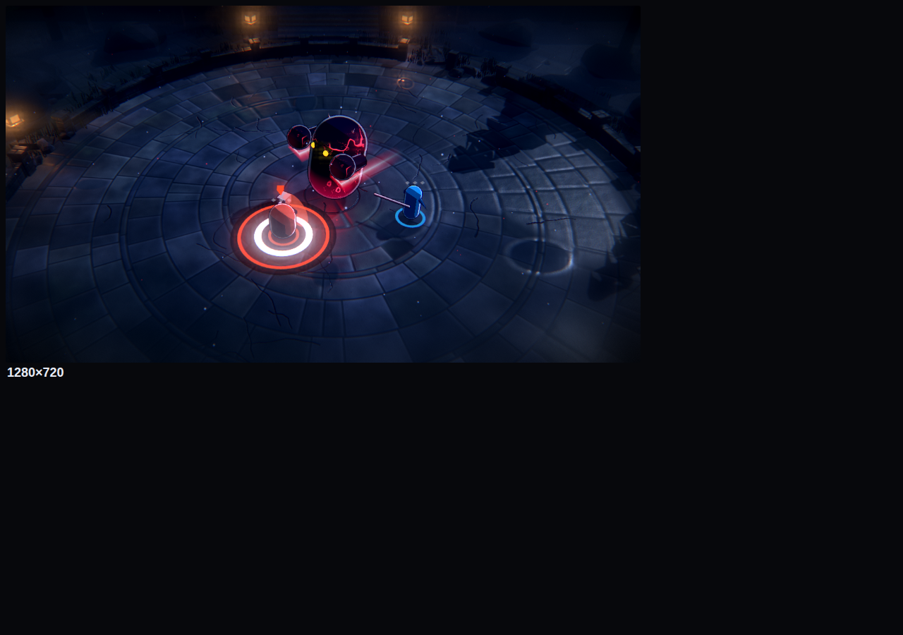
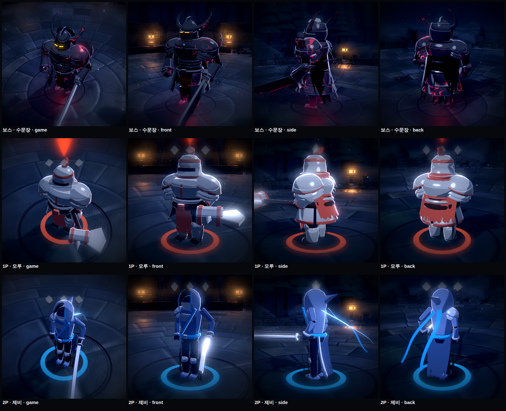
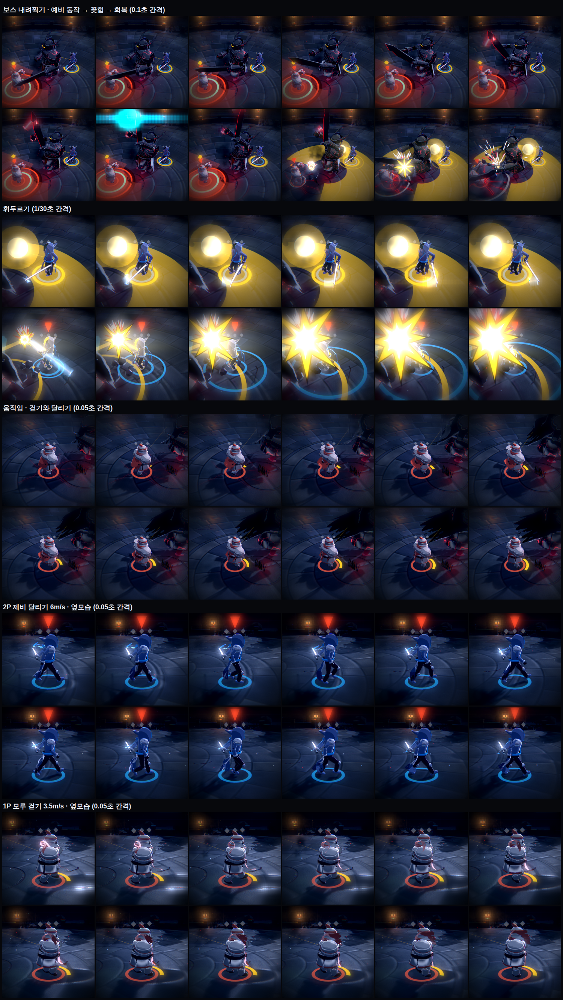

# 알파 · 레퍼런스 룩 (실제 게임 여섯 개)

> C 세션(`docs/실험/C-아트스타일.md`, `prototype/art-lab.html`)은 정해진 7초 장면에서 일곱 방향을 비교했다.
> 이 실험은 **실제 게임 하나를 레퍼런스로 정해 그 화면 문법을 따라가고**, **플레이 가능한 프로토타입 안에서** 바꿔 볼 수 있게 했다.
> 아트는 스킨이다(12절 앵커링 방지 프롬프트). 판정 색 — 주황 예고 = 받기 가능, 보라·사선 = 받기 불가, 금색 = 합 전용 — 은 어느 룩에서도 바꾸지 않았다.

## 고르는 법

타이틀 화면 **"화면"** 줄에서 고르거나 `H` 키. 게임 중엔 조정 패널(`` ` ``) → 아트 스타일. "후처리" 체크를 끄면 후처리 없이 비교할 수 있다.
폰에서는 화면을 고른 뒤 **합 연출 보기**(4)로 보면 된다.

## 왜 이 여섯 개인가

공통 조건: **쿼터뷰/위에서 내려다보는 보스전**에서 이미 검증됐거나, 사용자 메모(빠르고 스타일리시, 나이트런 결의 특수 무기, 붉은 디바 기체, 무대 스킨)와 닿아 있는 것.

| 룩 | 레퍼런스 | 이 게임과 맞는 이유 | 따라 한 화면 문법 | 위험 |
|---|---|---|---|---|
| **하데스** | Hades (Supergiant) | 쿼터뷰 액션의 기준. 작은 캐릭터도 굵은 먹선과 강한 위 조명으로 읽힌다 | 굵은 검은 외곽선(3.2px), 위에서 내리꽂는 단단한 빛, 보랏빛 그림자, 한쪽에서 오는 불빛 림, **붓 질감(쿠와하라 필터)**, 발밑 용암 균열, 그리스 무늬 띠, 화로 점광원, 불티 | 어둡다. 주황 예고와 용암이 같은 계열 → 용암은 아레나 밖에만 둔다 |
| **퓨리** | Furi (Takashi Okazaki) | **게임 구조가 가장 닮았다.** 위에서 보는 1:1 보스 결투, 튕겨내기 중심 | 하드 2단 명암, 짙은 보라 그림자, 청록 역광 림, 노을-자홍 하늘, **구름 바다 위에 뜬 육각 결투장**, 네온 선, 떠 있는 비석, 색수차 | 네온 선이 많으면 공격 예고와 헷갈린다 → 선은 아레나 고정 무늬에만 |
| **하이파이 러시** | Hi-Fi RUSH (Tango) | "무대" 바이럴 스킨과 가장 잘 붙는다. 박자 게임이지만 화면 문법만 빌린다(음악은 판정에 안 넣음) | 가장 굵은 외곽선(3.8px), 하드 2단, 파란 그림자, **망점(벤데이 점)**, 팝 색 테두리 고리, 스피커와 트러스, 핀 조명, 색종이 | 밝은 바닥에 예고가 묻힌다 → **싸우는 안쪽은 중간 명도**로 낮추고 팝 색은 바깥 고리에만 (한 번 실패하고 고침) |
| **데스 도어** | Death's Door (Acid Nerve) | 쿼터뷰 보스 액션. 색을 아껴서 **두 사람과 금색이 가장 귀하게** 보인다 | 거의 없는 외곽선(1px), 낮게 깔린 옆빛과 긴 그림자, 짙은 안개, 채도를 뺀 잿빛, 닳은 판석과 이끼, 고딕 기둥과 가로등, 재 먼지, 필름 입자, 붓 질감 | 전체가 어두운 회색이라 오래 보면 지루하다 |
| **하이퍼 라이트** | Hyper Light Drifter / Breaker | 빠른 대시 액션의 파스텔 네온. 사용자 메모의 "빠르고 스타일리시"와 닿는다 | **외곽선 없음**, 평평한 2단, 분홍-보라 하늘과 허공, **픽셀화(3px) + 색 단계 줄이기**, 청록 풀밭, 고대 문양 타일, 떠 있는 수정 기둥, 반짝이 | 픽셀화로 작은 표시(충격 칸, ◆)가 뭉개진다 |
| **디 어센트** | The Ascent · Ghostrunner | 나이트런 결의 SF, 붉은 디바 기체·검은 갑주 안무와 가장 잘 붙는다 | 어둠 속 **자기 색 림**(네온), 자홍·청록 점광원, 젖은 금속판과 네온 이음매, **옥상 아래 도시 불빛**, 네온 간판(파동·LIVE·합), 비, 강한 블룸, 색수차, 주사선 | 밝은 효과가 많으면 블룸이 받기 링을 번지게 한다 |

## 공통으로 만든 기반 (다른 룩을 더할 때 재사용)

- **툰 재질 주입**: 모든 툰 재질에 림(색·폭·방향·자기 색)과 그림자 색 이동을 넣었다. 바닥은 림을 빼고 그림자 색만.
- **외곽선**: 뒤집은 껍데기를 **화면 픽셀 기준**으로 밀어낸다(720p 기준 px, 화면 높이에 비례). 상자도 모서리가 갈라지지 않게 같은 자리 꼭짓점 법선을 평균 냈다. 예전 "크기 배율" 방식은 큰 보스와 작은 칼의 선 굵기가 달랐다.
- **후처리 파이프라인**: 4배 MSAA 장면 → 블룸 2단(1/4, 1/8 해상도) → 합성(쿠와하라 붓 질감, 픽셀화, 색수차, 감마·리프트·게인, 채도·대비, 그림자/밝은 곳 색 분리, 망점, 색 단계, 주사선, 비네트, 필름 입자).
- **하늘과 발밑**: 쿼터뷰라 하늘은 안 보이고 **아레나 바깥 아래쪽**이 보인다. 그래서 하늘 구의 아랫면을 "먼 바닥"으로 펼쳐 용암 균열 / 구름 바다 / 도시 불빛 / 파스텔 허공을 그렸다.
- **바닥 그림**: 캔버스로 그린다(원기둥 윗면 UV가 원 모양이라 캔버스 가운데 = 아레나 가운데).
- **소품·빛·입자**: 룩마다 소품 묶음, 점광원(깜빡임), 떠 있는 물체(흔들림), 입자 420개(불티·먼지·색종이·빗줄기·반짝이)를 바꿔 끼운다.
- 기존 세 스타일(기본 툰, 파스텔, 강한 대비)과 A 세션의 임팩트 프레임·어둡게 하기 연출은 그대로 동작한다.

## 검사

- `node looks.mjs`: 룩마다 "예비 동작"(주황 예고 + 받기 링)과 "틈 열림"(금색 부채꼴 + 2P 휘두름)을 찍어 비교판(`prototype/test/out/look_sheet.png`)으로 묶는다. 오류 0.
- `node smoke.mjs`: 기존 게임 시나리오 전체 통과.
- 판독: 일곱 룩 모두에서 주황 예고, 흰 받기 링, 금색 틈이 보였다. 하이파이 러시 첫 버전은 바닥이 너무 밝아 예고가 사라져서 고쳤다.

## 이번엔 만들지 않은 후보

| 레퍼런스 | 이유 |
|---|---|
| 젠레스 존 제로 | 도시 셀 애니 + 컷인. C 세션의 "셀 애니"와 하이파이 러시 사이에 있다 |
| 길티기어 스트라이브 / 아크 시스템 웍스 | 3D를 2D 애니처럼(제한 프레임, 손으로 다듬은 법선). 캐릭터 모델이 생긴 뒤에야 의미가 있다 |
| 오카미 | 먹선. C 세션이 이미 만들었다 |
| 스플래툰 / 젯 셋 라디오 | 밝은 팝. 하이파이 러시와 겹친다 |
| 나이트런(웹툰) | 직접 게임 레퍼런스는 아니지만 디 어센트 룩이 그 결에 가장 가깝다 |

## 내 추천 (판단은 사용자)

1. **디 어센트**: 사용자가 말한 세계(파동, SF 특수 무기, 붉은 디바 기체, 검은 갑주 안무)와 바로 붙는다. 무대 스킨도 네온 간판·조명으로 자연스럽다. 다만 블룸 세기는 실제 플레이로 조여야 한다.
2. **퓨리**: 게임 구조가 가장 닮았다(위에서 보는 튕겨내기 결투). 하늘 위 결투장이라 보스마다 하늘색만 바꿔도 마당이 달라진다.
3. **하데스**: 가장 안전하게 "잘 만든 쿼터뷰"로 보인다. 다만 이미 너무 유명한 얼굴이다.

## 한계

- 캐릭터와 보스는 여전히 기본 도형이다. 룩은 빛, 선, 재질, 배경, 후처리까지만 바꾼다.
- 헤드리스 브라우저(소프트웨어 GPU)로만 확인했다. 폰 GPU에서 붓 질감(쿠와하라, 픽셀당 36번 샘플)은 느릴 수 있다. 느리면 패널에서 후처리를 끄면 된다.
- 스크린샷은 멈춘 장면이다. 입자, 불꽃 깜빡임, 비, 떠 있는 소품의 움직임은 직접 봐야 한다.

## 스프링 송 벤치마크 (사용자 요청)

> 레퍼런스: 「Fate/stay night [Heaven's Feel] III. spring song」(ufotable), 메두사 대 세이버 장면.
> **캐릭터 디자인(얼굴, 옷, 무기, 사슬, 갑옷 모양)은 가져오지 않았다.** 가져온 건 그 장면이 화면을 만드는 방법(빛, 합성, 연출)뿐이다.
> 저작권 대상인 캐릭터를 옮기지 않으면서, "그 장면을 볼 때의 느낌"이 어디서 오는지를 우리 보스와 두 사람에게 나눠 입혔다.

### 장면의 문법 → 우리 게임

| 그 장면에서 화면을 만드는 것 | 우리 게임에 옮긴 것 | 어디에 |
|---|---|---|
| 검게 물든 기사: 검은 몸에 흐르는 붉은 선, 몸에서 피어오르는 검은 기운 | 보스 몸을 거의 검게 + **드문드문 흐르는 붉은 맥**(맥동), 아래에서 배어 나오는 붉은빛, **검은 연기 오라**(예비 동작 중엔 짙어짐) + 붉은 불티, 보스 몸에서 나오는 **붉은 점광원**이 바닥과 두 사람의 옆면을 물들임 | 보스 |
| 무거운 검이 지나간 자리의 검붉은 궤적 | (2차) 보스 대검이 내려칠 때 **검은 심 + 붉은 테의 참격**, 재처럼 바스러짐 | 보스 |
| 초고속 전투원: 빛의 줄기로만 보이는 이동, 길게 남는 잔상 | 무기 끝의 **빛 궤적**(가운데 흰 심, 가장자리 자기 색), 회피·끼어들기 때 **몸의 궤적** | 1P·2P |
| 차가운 달빛 역광 | 뒤쪽 높은 달빛 + 한쪽에서만 오는 **차가운 림**, 짙은 남색 그림자 | 전체 |
| 충돌 순간의 합성: 불꽃, 흙먼지, 파편, 공기가 일그러짐 | 받기 = 흰·붉은 **불꽃 줄기** + 흙먼지 고리 + 작은 **파편**(튀고 굴러감) + **충격파 화면 왜곡**. 보스 내려찍기 = 큰 파편, 검은 진흙 튐, 붉은 불티, 바닥에 **붉게 빛나는 균열**. 합 = 가장 큰 왜곡 | 판정 순간 |
| 렌즈: 빛이 가로로 길게 번짐, 가장자리 흐림, 입자감 | **아나모픽 빛 번짐**(밝은 점이 가로로 푸르게), **가장자리 흐림**(화면 바깥쪽만), 색수차, 필름 입자, 짙은 비네트 | 후처리 |
| 배경: 달밤의 돌 마당과 돌계단, 젖은 돌, 숲과 안개 | (2차에서 바꿈) 떠 있는 원판 대신 **지평까지 이어지는 판석 땅과 둥근 돌 마당**(PBR, 젖은 자리·물웅덩이에 달빛), 무너진 돌난간, 화면 위쪽의 축대·돌계단·문기둥과 석등, 바위, 삼나무 숲, 낮은 안개. 붉은 맥은 보스와 보스가 부순 바닥의 균열에만 | 아레나 |

- 판정 색은 그대로다. 주황 예고는 붉은 쪽으로 조금 기울지만 따뜻한 채움 + 흰 받기 링으로 읽힌다. 금색 틈도 그대로.
- 다른 룩에서는 이 연출(오라, 궤적, 파편, 왜곡)이 꺼져 있다.

### 확인
- `node springsong.mjs`: 자동 관람을 실제로 돌리며 예비 동작 / 휘두르는 중 / 받아낸 순간 / 완벽한 합 정지 / 해방 / 다음 예비 동작 / 휘청임을 찍는다 (`prototype/test/out/ss_sheet.png`, 문서에는 `알파-스프링송.png`).
- 첫 시도에서 고친 것: 달빛 기둥 메시는 위에서 보면 커다란 반투명 띠가 돼서 뺐다. 보스 붉은 맥이 너무 촘촘해 대리석처럼 보여서 가늘고 드물게 줄였다. 림이 너무 세서 두 사람 색이 하얗게 날아가 낮췄다.

### 2차: 단계별로 극장판 수준까지 (사용자 요청: "원통 + 필터는 우주에서 싸우는 것처럼 보인다, 돌 배경, 캐릭터도 최대치로, 깜빡임은 스스로 검수")
단계별 작업 지시서와 측정값은 [알파-스프링송-프롬프트.md](알파-스프링송-프롬프트.md)에 있다. 요약:

| 단계 | 한 것 | 객관 기준 → 결과 |
|---|---|---|
| 1 깜빡임 | 깜빡임 측정 도구, 원인 7가지 제거 | 8개 룩 모두 통과 (스프링 송 jump 0.04~0.08%, 기준 1.5%) |
| 2 돌 배경 | 떠 있는 원판 → 지평까지 이어지는 판석 땅 + 둥근 돌 마당, 무너진 난간, 축대·돌계단·문기둥, 석등, 바위, 삼나무 숲, 안개 | 화면 가장자리 허공 0/24, 예고 테두리 대비 3.4~4.3:1 |
| 3 캐릭터 | 보스 「수문장」(판갑 기사 + 외날 대검 + 망토), 1P 「모루」(넓은 판갑 + 망치), 2P 「제비」(긴 몸 + 두건 + 천 두 갈래 + 긴 칼) | 160px 실루엣 겹침 IoU 0.41~0.50 (기준 0.6 미만) |
| 4 움직임 | 걸음·다리 IK, 무게 스프링(예비 동작 → 넘어섬), 천 베를레, 잔상 | 천 파고듦 0 (최대 0.2cm) |
| 5 이펙트 | 섬광 → 가로 번짐 → 불꽃 줄기 → 먼지 → 균열, 보스 참격(검은 심 + 붉은 테), 지형 파쇄 | 판정 표시를 가린 시간 0초, 섬광 0.084초 |
| 6 마무리 | 폰에서도 보이게 중간 톤·원경 안개 조정, 종합 검수 | 아래 표 |

### 못 한 것 (그 장면과의 차이)
- **카메라.** 그 장면의 힘은 절반이 카메라(빠르게 돌고 파고드는 3D 카메라)다. 우리는 쿼터뷰 고정이라 합 순간의 짧은 줌·기울기까지만 쓴다. 다시 보기에 이 룩 전용 카메라 동선을 넣으면 가장 크게 좋아질 것이다.
- **작화.** ufotable은 손으로 그린 작화(얼굴, 옷 주름, 효과의 붓질)와 3D를 합성한다. 여기서는 모델·움직임·효과 모두 코드로 만든 절차 생성이다. 얼굴과 손가락은 없고(투구·가면·쇠장갑으로 가림), 판의 모양은 회전체·상자 조합이다.
- **원화의 과장.** 손으로 잡은 키프레임의 늘이기·찌그러뜨리기·홀드 포즈는 스프링과 IK로 다 못 낸다.
- **배경 원경.** 쿼터뷰라 축대·숲은 화면 위쪽 띠에만 보인다. 하늘·달은 다시 보기 카메라에서만 보인다.
